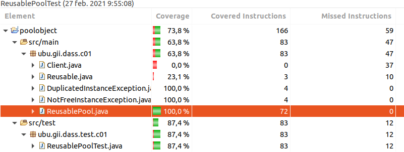

poolobject
==========

  

Java code example of creational design pattern pool object

Workshop to use good practices in software developmemnt: testing and measurement.

Authors:

- Carlos Lopez Nozal
- Jesus Alonso Abad

# Informe

## Autores
- Marcos Romano Ibáñez.
- María Portugal Tomé.

## Enunciado
En la práctica se va simular un pequeño desarrollo de un producto software para realizar mediciones sobre él.

## Objetivo
- Establecer un caso de estudio que sirva para caracterizar y evaluar tanto el producto desarrollado como el proceso seguido.
## Proceso de prueba

Para la realización de esta practica se ha seguido el siguiente proceso:
1. Registrarse en `Travis CI` y en `Codecov.io` y vincular el proyecto.
2. Evaluar las diferentes clases que componen el proyecto. 
3. Empezar a realizar la integración de las pruebas.

### Cobertura de las pruebas

Como se demuestra en la siguiente ilustración se obtiene una covertura del 100% sobre la clase ReusablePool, así como en las dos excepciones (DuplicateInstanceException y NotFreeInstanceException) que se lanzan desde esta misma clase.

## Preguntas

1. ¿Se ha realizado trabajo en equipo?
   - Si.
2. ¿Tiene calidad el conjunto de pruebas disponibles?
   - Se obtiene una covertura del 100% para el fichero ReusablePool.java. En consecuencia, todas las clases utilizadas en los test de ReusablePool tienen una cierta covertura en la misma proporción en la que participan en los test. Es por esto que, por ejemplo, las excepciones DuplicateIntanceException y NotFreeInstanceException tienen una covertura del 100%, pues se tratan de manera indirecta en el test, mientras que la clase Client tiene una covertura del 0%, pues no aparece en el test.
3. ¿Cuál es el esfuerzo invertido en realizar la actividad?
   - Revisión del código del que se parte llevó 10 minutos.
   - Método setup del test ReusablePoolTest llevó 5 minutos.
   - Método tearDown del test ReusablePoolTest llevó 5 minutos.
   - Método testGetInstance del test ReusablePoolTest llevó 10 minutos.
4. ¿Cuál es el número de fallos encontrados en el código?

## Enlaces

