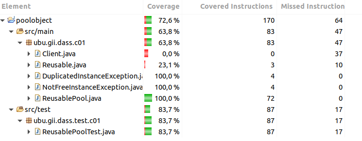

poolobject
==========

  

Java code example of creational design pattern pool object

Workshop to use good practices in software developmemnt: testing and measurement.

Authors:

- Carlos Lopez Nozal
- Jesus Alonso Abad

# Informe

## Autores
- Marcos Romano Ibáñez.
- María Portugal Tomé.

## Enunciado
En la práctica se va simular un pequeño desarrollo de un producto software para realizar mediciones sobre él.

## Objetivo
- Establecer un caso de estudio que sirva para caracterizar y evaluar tanto el producto desarrollado como el proceso seguido.
## Proceso de prueba

Para la realización de esta practica se ha seguido el siguiente proceso:
1. Registrarse en `Travis CI` y en `Codecov.io` y vincular el proyecto.
2. Evaluar las diferentes clases que componen el proyecto. 
3. Empezar a realizar la integración de las pruebas.

### Covertura de las pruebas

Como se demuestra en la siguiente ilustración se obtiene una covertura del 100% sobre la clase ReusablePool, así como en las dos excepciones (DuplicateInstanceException y NotFreeInstanceException) que se lanzan desde esta misma clase.

#### Covertura de las pruebas usando EclEmma

## Especificación textual de la prueba commit

| Test Method | Descripción | Entrada | Salida Esperada |
| :---:| :---: | :---:| :---: |
| setUp() | Estado inicial de los métodos a probar | - | - |
| tearDown() | Estado final de los métodos a probar| - | - |
|testGetInstance() | Determinar si se crea correctamente una instancia de un objeto Pool| - | - |
|testAcquireReusable() | Comprobar que se obtiene una instancia de ReusablePool si se encuentra disponible, en caso contrario comprobar que se lanza la excepción| - | - |
|testReleaseReusable() | Determinar si se libera correctamente una instancia Reusable y se añade al Pool, siempre y cuando esta no esté ya añadida, en este caso se comprueba que se lanza una excepción.| - | - |

### Especificación paso a paso de la prueba commit

#### setUp()

| Paso | Pasos de la inicialización de los test |
| :---: | :---: |
| 1 | Obtener la instancia de ReusablePool con la que se va a trabajar |

#### tearDown()

| Paso | Pasos de la finalización de los test |
| :---: | :---: |
| 1 | Resetear la instancia del Singleton de ReusablePool |

#### testGetInstance()

| Paso | Descripción | Salida Esperada | Salida Actual |
| :---: | :---: | :---: | :---: |
| 1 | Comprobar que la instancia obtenida en el setUp no es null | True | True |
| 2 | Obtener una instancia nueva de ReusablePool | - | - |
| 3 | Comprobar que ambas instancias de ReusablePool son la misma | True | True |

#### testAcquireReusable()

| Paso | Descripción | Salida Esperada | Salida Actual |
| :---: | :---: | :---: | :---: |
| 1 |  Comprobar que el Pool no es nulo | True | True |
| 2 | Comprobar que el tamaño inicial del pool es 2 | True | True|
| 3 | Obtener una instancia de un objeto Reusable y que esta no sea nula| True | True|
| 4 | Comprobar que el tamaño del pool ahora sea 1 | True | True |
| 5 | Obtener una instancia de un objeto Reusable y que esta no sea nula| True | True|
| 6 | Comprobar que el tamaño del pool ahora sea 0 | True | True |
| 7 | Obtener otra instancia del objeto pool y que salte una excepción| - | - |
| 8 | Capturar la excepción y comprobar que el mensaje sea el correcto | True | True|

#### testReleaseReusable()
| Paso | Descripción | Salida Esperada | Salida Actual |
| :---: | :---: | :---: | :---: |
| 1 |  Comprobar que el Pool no es nulo | True | True |
| 2 | Comprobar que el tamaño inicial del pool es 2 | True | True|
| 3 | Obtener una instancia de un objeto Reusable (r) y que esta no sea nula| True | True|
| 4 | Comprobar que el tamaño del pool ahora sea 1 | True | True |
| 5 | Liberar r | - | - |
| 6 | Comprobar que el tamaño del pool ahora sea 2, esto implica que se a añadido correctamente | True | True |
| 7 | Liberar otra vez el mismo objeto Reusable (r) y comprobar que se lanza la excepción correcta | - | - |

## Preguntas

1. ¿Se ha realizado trabajo en equipo?
   - Marcos: aprox 12.
   - Maria: aprox 12.
   - https://github.com/mpt1002/poolobject/pulse
2. ¿Tiene calidad el conjunto de pruebas disponibles?
   - Se obtiene una covertura del 100% para el fichero ReusablePool.java. En consecuencia, todas las clases utilizadas en los test de ReusablePool tienen una cierta covertura en la misma proporción en la que participan en los test. Es por esto que, por ejemplo, las excepciones DuplicateIntanceException y NotFreeInstanceException tienen una covertura del 100%, pues se tratan de manera indirecta en el test, mientras que la clase Client tiene una covertura del 0%, pues no aparece en el test.
3. ¿Cuál es el esfuerzo invertido en realizar la actividad?
   - Revisión del código del que se parte llevó 20 minutos.
   - Método setup del test ReusablePoolTest llevó 5 minutos.
   - Método tearDown del test ReusablePoolTest llevó 5 minutos.
   - Método testGetInstance del test ReusablePoolTest llevó 10 minutos.
   - Método testAcquireReusable del test ReusablePoolTest llevó 45 minutos.
   - Método testReleaseReusable del test ResusablePoolTest llevó 45 minutos.
4. ¿Cuál es el número de fallos encontrados en el código?
   - Inicialemente tuvimos problemas con la librería JUnit.
   - Después tuvimos un problema con los tests relaciona con jacoco, lo cual se solucionó con la modificación del fichero `travis.yaml` introduciendo un conjunto de versiones de Java.

## Comentarios

- Se ha añadido un método size en la clase ReusablePool para la mejora de la implementación de los test.
  - size(): obtener el número de objetos Reusable que hay dentro de un pool.

- Al no existir un método que resetee la instancia del singleton ReusablePool se han realizado los test teniendo en cuenta que el estado final de la pool del test anterior es el estado inicial de la pool del nuevo test.